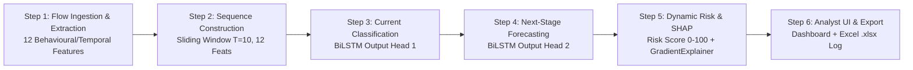

# AI-Based Network Attack Forecasting System
### Smart India Hackathon (SIH) Problem Statement ID: **SIH26153**
> **"AI based Network Attack Forecasting from Network Traffic Data"**

An intelligent cybersecurity defense system that forecasts the most probable **NEXT stage** of a multi-stage cyber attack before it is confirmed. By moving from purely reactive detection to proactive probabilistic forecasting, security teams can implement automated, non-disruptive preventive controls before an attacker executes an intrusion or establishes persistence.

---

## Table of Contents
1. [Core Features](#core-features)
2. [Prerequisites & Installation](#prerequisites--installation)
3. [How to Run the Application](#how-to-run-the-application)
4. [Using the Analyst Dashboard](#using-the-analyst-dashboard)
5. [Training & Testing](#training--testing)
6. [System Architecture & 6-Step Pipeline](#system-architecture--6-step-pipeline)
7. [API Endpoints Reference](#api-endpoints-reference)
8. [Dataset Balancing Note](#dataset-balancing-note)
9. [Project Directory Structure](#project-directory-structure)

---

## Core Features

- **Multi-Stage Attack Progression**: Models the conceptual progression:
  $$\text{Reconnaissance} \longrightarrow \text{Scanning} \longrightarrow \text{Enumeration} \longrightarrow \text{Exploitation} \longrightarrow \text{Intrusion}$$
  Tolerates pauses (benign background traffic), retries, and behavioral variations.
- **Dual-Head BiLSTM Neural Network**: 
  - **Head 1 (Current Classifier)**: Classifies the active attack phase.
  - **Head 2 (Next-Stage Forecaster)**: Predicts the probability distribution over candidate next stages conditioned on temporal sequences ($T=10$).
- **Dynamic Risk Engine (0–100)**: Combines sequence forecast probability, phase transition severity weight, and anomalous flow density into categorical risk levels (`LOW`, `MEDIUM`, `HIGH`).
- **Explainable AI (SHAP GradientExplainer)**: 
  - Top feature attribution rankings identifying exact behavioral risk drivers.
  - Force-plot contribution view decomposing baseline vs. forecast probability.
- **Ranked Non-Blocking Defensive Countermeasures**: Generates 2–4 prioritized mitigation actions with explicit feature-based rationales citing top SHAP risk drivers (e.g., port diversity, fanout rate, packet rate).
- **Dual Ingestion Modes**:
  - **Synthetic Flow Stream**: Chronologically advances simulated multi-stage attack scenarios.
  - **Real CICIDS2017/2018 Ingestion**: Automatically windowed playback through actual network flow CSV data.
- **Excel (.xlsx) Export Engine**: One-click download of all session forecasts formatted with `openpyxl` (frozen headers, Arial typography, auto-sized columns, conditional risk color fills, and no formula errors).

---

## Prerequisites & Installation

### 1. Requirements
- **Python 3.10, 3.11, 3.12, or 3.13**
- Windows, macOS, or Linux

### 2. Clone or Navigate to the Repository
```bash
cd sih
```

### 3. (Recommended) Create and Activate a Virtual Environment
- **Windows (PowerShell)**:
  ```powershell
  python -m venv venv
  .\venv\Scripts\Activate.ps1
  ```
- **macOS / Linux**:
  ```bash
  python3 -m venv venv
  source venv/bin/activate
  ```

### 4. Install Dependencies
```bash
pip install -r requirements.txt
```

---

## How to Run the Application

### Option A: Quickstart (Recommended)
Run the launcher script:
```powershell
python run_demo.py
```
This starts the local FastAPI server and hosts the security dashboard.

### Option B: Using Uvicorn Directly
You can run the server directly with live-reloading enabled for development:
```powershell
python -m uvicorn dashboard.server:app --host 127.0.0.1 --port 8000 --reload
```

### Accessing the System
Once the server is running:
- **Analyst Dashboard**: Open [http://localhost:8000](http://localhost:8000) or [http://127.0.0.1:8000](http://127.0.0.1:8000) in any web browser.
- **Interactive API Docs (Swagger / OpenAPI)**: Open [http://localhost:8000/docs](http://localhost:8000/docs).

---

## Using the Analyst Dashboard

The web dashboard is built for security analysts and SOC teams:

1. **Exact Output Banner**:
   Displays the required SIH output specification in real time:
   ```
   Current: Scanning → Predicted Next: Enumeration → Confidence: 87% → Risk: HIGH
   ```
2. **Conceptual Attack Progression (Step Indicator)**:
   - Visually indicates all 5 stages horizontally.
   - Nodes indicate `CURRENT ACTIVE` (blue pulse glow), `FORECASTED NEXT` (dashed border), and `PASSED`.
   - The connector highlight bar dynamically lights up across completed steps and links to the next forecasted phase.
3. **Live Stream Advancement (`Advance Flow Stream` button)**:
   - Click to step through sequential windows of the synthetic multi-stage attack timeline.
   - Watch the active stage advance through Reconnaissance $\rightarrow$ Scanning $\rightarrow$ Enumeration $\rightarrow$ Exploitation $\rightarrow$ Intrusion.
4. **Real Data Playback (`Load Real CICIDS Sample` button)**:
   - Ingests real CICIDS2017 flow data (`data/sample_cicids2017.csv`).
   - Automatically walks through sliding $T=10$ windows with smooth 1.4s animated playback.
5. **Export to Excel (`Export to Excel` button)**:
   - Click to generate and download a `.xlsx` report containing every forecast generated during your session.
6. **Explainable AI (SHAP Module Tabs)**:
   - **Feature Rankings**: Displays the top 12 flow features ranked by absolute SHAP impact with positive/negative direction.
   - **Force View**: Interactive force bars showing base probability vs. model forecast.
7. **Ranked Preventive Responses**:
   - Provides prioritized security controls (Priority 1, 2, 3) citing specific feature anomalies.

---

## Training & Testing

### 1. Retrain the BiLSTM Model
To regenerate the synthetic training dataset, fit the feature scaler, and train the dual-head BiLSTM from scratch:
```powershell
python train.py
```
This outputs:
- Model weights: `models/bilstm_weights.pt`
- Feature scaler: `pipeline/scaler.pkl`
- Background samples for SHAP: `pipeline/background_samples.npy`

### 2. Run Automated Unit & Integration Tests
Execute the full pytest test suite:
```powershell
python -m pytest tests/test_pipeline.py -v
```
The test suite validates:
1. Feature extraction from raw network flows (12 features across 6 categories).
2. Temporal sequence construction ($T=10$ sliding windows).
3. Dual-head BiLSTM forward pass and probability constraints ($\sum p = 1.0$).
4. Dynamic Risk Engine calculations and categorical thresholds.
5. SHAP `GradientExplainer` attribution rankings and force-plot structures.
6. FastAPI endpoints (`/api/forecast`, `/api/stream`).
7. Real CICIDS2017/2018 CSV parsing and `/api/ingest-real`.
8. Dynamic windowed streaming and feature-rationalized defenses.
9. Excel export workbook schema, frozen panes, formatting, and formula integrity.
10. Synthetic dataset equal-per-stage balancing.

---

## System Architecture & 6-Step Pipeline



### 12 Extracted Features across 6 Categories:
| Category | Feature Name | Description |
| :--- | :--- | :--- |
| **Connection Frequency** | `conn_frequency` | Connections initiated per second |
| | `packet_rate` | Average packets transmitted per second |
| **Source–Dest Relationships** | `dst_ip_fanout` | Number of unique target IPs contacted |
| | `src_dst_entropy` | Shannon entropy of source-to-destination pairs |
| **Port-Access Patterns** | `port_diversity` | Number of distinct destination ports accessed |
| | `well_known_port_ratio` | Proportion of traffic targeting standard ports (0–1023) |
| **Host Discovery** | `host_sweep_rate` | Velocity of sequential IP addressing probes |
| | `icmp_arp_ratio` | Ratio of control plane traffic (ICMP/ARP) |
| **Service Enumeration** | `service_probe_rate` | Rapid query frequency against application services |
| | `targeted_query_volume` | Volume of targeted protocol banner interactions |
| **Timing Irregularities** | `iat_jitter` | Inter-arrival time variance and deviation |
| | `burstiness_index` | Peak-to-average transmission ratio |

---

## API Endpoints Reference

| Method | Endpoint | Description |
| :--- | :--- | :--- |
| `GET` | `/` | Serves the interactive analyst dashboard UI |
| `POST` | `/api/forecast` | Computes forecast, dynamic risk score, and SHAP attributions for a provided sequence (or current active window) |
| `GET` | `/api/stream` | Advances the simulated multi-stage attack stream by one window ($T=10$) |
| `POST` / `GET`| `/api/ingest-real` | Ingests uploaded CICIDS CSV or default sample, returning sequential windowed forecasts |
| `GET` | `/api/ingest-real-stream` | Delivers the next sequential window from ingested real CICIDS data |
| `POST` / `GET`| `/api/export-xlsx` | Generates and downloads a `.xlsx` Excel workbook logging forecast session history |
| `GET` | `/docs` | Interactive Swagger/OpenAPI documentation |

---

## Dataset Balancing Note

> **Engineering Assumption**: In real-world enterprise network traffic, attack traffic is **not** evenly distributed across stages: early stages (*Reconnaissance* and *Scanning*) are far more common than confirmed *Intrusion*, as the majority of hostile probes stall, get dropped by firewalls, or are mitigated before penetration.
>
> In this prototype, **equal-per-stage balancing** (approx. 20% representation per stage across both the training dataset and the live `/api/stream` generator) is a deliberate engineering choice. This ensures balanced gradient updates across all 5 classes, eliminates late-stage (Intrusion) bias, and allows clean demonstration of stage-to-stage transitions.

---

## Project Directory Structure

```
sih/
├── dashboard/
│   ├── server.py              # FastAPI server & endpoint controllers
│   └── static/
│       ├── index.html         # Analyst dashboard HTML structure
│       ├── style.css          # Design system, CSS variables & animations
│       └── app.js             # Real-time state management, count-ups & charts
├── data/
│   └── sample_cicids2017.csv  # 31-flow multi-stage real CICIDS2017 sample
├── models/
│   ├── attack_forecaster.py   # Dual-Head PyTorch BiLSTM neural network
│   ├── bilstm_weights.pt      # Pre-trained model weights
│   ├── risk_engine.py         # Dynamic risk engine & multiple defending methods
│   └── shap_explainer.py      # SHAP GradientExplainer wrapper
├── pipeline/
│   ├── dataset.py             # Rebalanced synthetic timeline & sequence generator
│   ├── excel_exporter.py      # Openpyxl Excel workbook generator
│   ├── feature_extractor.py   # 12-feature behavioural & temporal extractor
│   ├── real_flow_loader.py    # CICIDS2017/2018 CSV parser & window constructor
│   ├── background_samples.npy # SHAP reference baseline flows
│   └── scaler.pkl             # Fitted StandardScaler
├── tests/
│   └── test_pipeline.py       # 10 automated unit & integration tests
├── README.md                  # System documentation & usage guide
├── requirements.txt           # Python package dependencies
├── run_demo.py                # One-click application launcher
└── train.py                   # Model training & artifact export script
```
