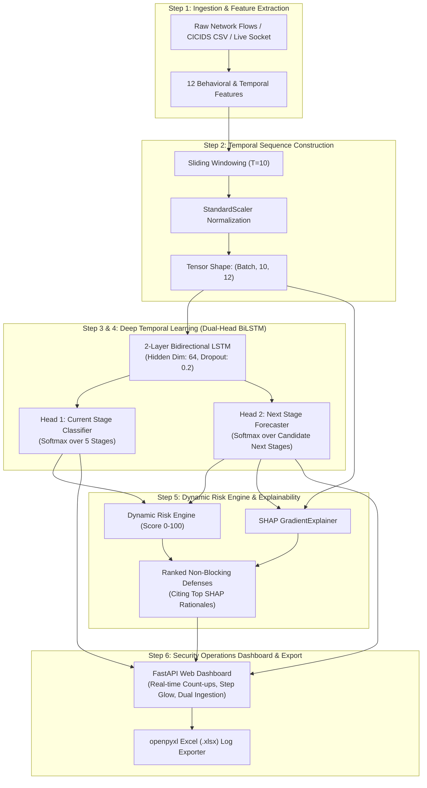

# PROJECT REPORT: AI-BASED NETWORK ATTACK FORECASTING SYSTEM
## Smart India Hackathon (SIH) — Problem Statement ID: SIH26153
### Topic: AI-based Network Attack Forecasting from Network Traffic Data

---

## Executive Summary

Modern cybersecurity operations rely heavily on Intrusion Detection Systems (IDS), Security Information and Event Management (SIEM) platforms, and signature-matching Intrusion Prevention Systems (IPS). While effective at flagging known malicious activity after the fact, these systems are fundamentally **reactive**: they trigger alerts only when an adversary has already probed, exploited, or breached a target host. In complex, multi-stage cyber attacks—such as Advanced Persistent Threats (APTs), ransomware campaigns, and lateral movement operations—alerting at the point of confirmed breach frequently results in irreversible data exfiltration, service disruption, or encryption.

This project presents an **AI-Based Network Attack Forecasting System** designed to solve SIH Problem Statement **SIH26153**. Instead of merely detecting the current attack stage, the system analyzes sliding temporal sequences ($T=10$) of behavioral and timing features extracted from raw network flows to **probabilistically forecast the most probable NEXT attack stage before it occurs**. 

The end-to-end framework implements an exact 6-step pipeline:
1. **Flow Ingestion & Behavioral Feature Extraction**: Ingests flow streams and computes 12 behavioral and temporal features across 6 distinct categories.
2. **Temporal Sequence Construction**: Generates standardized sliding temporal windows of length $T=10$ ($[B, 10, 12]$) benchmarked on CICIDS2017/2018 multi-stage attack distributions with balanced representation across all phases.
3. **Current Attack Stage Classification**: Uses a PyTorch 2-layer Bidirectional Long Short-Term Memory (BiLSTM) network with a dedicated classification head to identify the active phase.
4. **Probabilistic Next-Stage Forecasting**: Uses a secondary forecasting head conditioned on the BiLSTM sequence embeddings to predict probability distributions over candidate subsequent attack stages.
5. **Dynamic Risk Engine & Explainability**: Calculates a real-time risk score ($0–100$) and employs SHAP (`shap.GradientExplainer`) to extract feature importance rankings and force-plot contributions, generating 2–4 prioritized, non-blocking defensive countermeasures citing specific feature rationales.
6. **Security Monitoring Dashboard & Reporting**: A single-page, real-time web application featuring count-up animations, a dynamically bound step progression indicator, synthetic stream advancement, real-world CICIDS CSV ingestion, and an automated Excel (`.xlsx`) export engine.

---

## 1. Problem Definition & Motivation

### 1.1 The Challenge of Multi-Stage Attacks
Sophisticated cyber attacks do not occur as isolated events; they follow structured, goal-oriented lifecycles (often formalized as the Cyber Kill Chain or MITRE ATT&CK framework). An adversary systematically progresses through distinct phases:
1. Probing perimeter boundaries (**Reconnaissance**)
2. Discovering open listening services and ports (**Scanning**)
3. Fingerprinting specific service versions and application banners (**Enumeration**)
4. Weaponizing and triggering remote vulnerabilities (**Exploitation**)
5. Establishing persistence, command-and-control (C2) beaconing, and lateral expansion (**Intrusion**)

### 1.2 Limitations of Current Solutions
- **Alert Fatigue & Post-Mortem Logging**: Security Operations Centers (SOCs) receive thousands of alerts daily. By the time an exploitation or intrusion alert is correlated and triaged by a human analyst, the attacker has already compromised the host.
- **Lack of Predictive Foresight**: Traditional machine learning models in network security focus on binary classification (*Benign vs. Malicious*) or multi-class detection (*Which attack is happening now?*). They do not forecast *where the attack is heading next*.
- **Rigid Progression Assumptions**: Attackers often pause, repeat reconnaissance, encounter firewalls, or retry enumeration over hours or days. Systems that enforce rigid, linear state transitions fail under real-world timing variations.

### 1.3 Proposed Innovation
Our system transforms network defense from **reactive detection** to **probabilistic forecasting**:
- It evaluates flow patterns across time to identify early indicators.
- It calculates transition probabilities to forecast the next stage before confirmed execution.
- It arms defenders with proactive, non-blocking countermeasures (e.g., dynamic rate limiting, decoy service injection, tarpitting) tailored to the predicted next stage, neutralizing the attack path before penetration.

---

## 2. Conceptual Attack Progression Model

The system conceptualizes multi-stage attacks along five progressive stages:

```
[ Stage 1: Reconnaissance ]
          │
          ▼
[ Stage 2: Scanning ]
          │
          ▼
[ Stage 3: Enumeration ]
          │
          ▼
[ Stage 4: Exploitation ]
          │
          ▼
[ Stage 5: Intrusion ]
```

### Stage Characterization
1. **Reconnaissance**: Passive and active perimeter host discovery, ping sweeps, ICMP echo probes, and ARP queries designed to map live network infrastructure.
2. **Scanning**: Systematic SYN scans, high-frequency connection attempts across wide port ranges, and destination port diversity.
3. **Enumeration**: Deep interrogation of discovered open services, HTTP application probing, protocol banner grabbing, and targeted high-volume query exchanges.
4. **Exploitation**: Anomalous payload bursts, high packet rates, memory corruption exploits, command injection patterns, and irregular inter-arrival time (IAT) jitter.
5. **Intrusion**: Successful breach, internal C2 beaconing, lateral movement across subnets, elevated destination IP fanout, and data staging.

> **Non-Rigid Progression Principle**: The model does not mandate that every attack follow a strict, lock-step progression. The BiLSTM architecture naturally handles benign pauses, retries, and behavioral variations without breaking predictive continuity.

---

## 3. End-to-End System Pipeline Architecture



---

## 4. Feature Extraction & Engineering

The system extracts **12 behavioral and temporal features** grouped into **6 core analytical categories**:

| Category | Feature Key | Dimension | Analytical Significance |
| :--- | :--- | :--- | :--- |
| **Connection Frequency** | `conn_frequency` | Conns / sec | Detects rapid socket creation and automated probing scripts. |
| | `packet_rate` | Packets / sec | Identifies volumetric bursts typical of exploitation attempts. |
| **Source–Dest Relationships** | `dst_ip_fanout` | Count | Measures horizontal expansion (sweeping multiple internal hosts). |
| | `src_dst_entropy` | Bits (0.0–1.0) | Quantifies address dispersion; high entropy indicates wide scanning. |
| **Port-Access Patterns** | `port_diversity` | Count | Detects vertical port scans across diverse destination ports. |
| | `well_known_port_ratio` | Ratio (0.0–1.0) | High ratio indicates targeted attacks on standard services (80, 443, 22). |
| **Host Discovery** | `host_sweep_rate` | Hosts / sec | Captures velocity of sequential IP probing across subnet ranges. |
| | `icmp_arp_ratio` | Ratio (0.0–1.0) | Probes utilizing low-level control protocols for reachability. |
| **Service Enumeration** | `service_probe_rate` | Probes / sec | Interrogation velocity against specific application services. |
| | `targeted_query_volume`| Bytes / flow | High query-to-response payload volume indicating banner grabs. |
| **Timing Irregularities** | `iat_jitter` | Standard dev | High variance in packet inter-arrival times indicating evasive jitter. |
| | `burstiness_index` | Peak / Mean | Ratio of peak flow rate to average rate; highlights sudden exploitation spikes. |

---

## 5. Machine Learning Architecture: Dual-Head BiLSTM

### 5.1 Model Topology
Recurrent Neural Networks (RNNs) and Long Short-Term Memory (LSTM) networks excel at learning sequential dependencies. We utilize a **Bidirectional LSTM (BiLSTM)** to capture temporal context in both forward and backward time directions across sliding flow sequences.

```
                  ┌────────────────────────────────────────┐
Input Sequence ──►│  Bidirectional LSTM (Layer 1, Dim 64)  │
[B, 10, 12]       └───────────────────┬────────────────────┘
                                      │ Dropout (p=0.2)
                  ┌───────────────────▼────────────────────┐
                  │  Bidirectional LSTM (Layer 2, Dim 64)  │
                  └───────────────────┬────────────────────┘
                                      │
                   Concatenated Hidden Representations [h_fwd, h_bwd] (Dim 128)
                                      │
               ┌──────────────────────┴──────────────────────┐
               ▼                                             ▼
  ┌─────────────────────────┐                   ┌─────────────────────────┐
  │ Head 1: Current Stage   │                   │ Head 2: Next Stage      │
  │ Linear(128, 64) -> ReLU │                   │ Linear(128, 64) -> ReLU │
  │ Linear(64, 5)           │                   │ Linear(64, 5)           │
  │ Softmax                 │                   │ Softmax                 │
  └────────────┬────────────┘                   └────────────┬────────────┘
               ▼                                             ▼
     Current Stage Probs                         Predicted Next Stage Probs
```

### 5.2 Mathematical Formulation
Given an input temporal sequence $\mathbf{X} = (\mathbf{x}_1, \mathbf{x}_2, \dots, \mathbf{x}_T) \in \mathbb{R}^{T \times D}$ where $T=10$ and $D=12$:
1. Forward hidden state: $\overrightarrow{\mathbf{h}}_t = \text{LSTM}_{\text{fwd}}(\mathbf{x}_t, \overrightarrow{\mathbf{h}}_{t-1})$
2. Backward hidden state: $\overleftarrow{\mathbf{h}}_t = \text{LSTM}_{\text{bwd}}(\mathbf{x}_t, \overleftarrow{\mathbf{h}}_{t+1})$
3. Sequence representation: $\mathbf{h}_T = [\overrightarrow{\mathbf{h}}_T \,\|\, \overleftarrow{\mathbf{h}}_1] \in \mathbb{R}^{2H}$
4. Multi-Task Objective Function:
   $$\mathcal{L}_{\text{total}} = \mathcal{L}_{\text{CE}}(\hat{\mathbf{y}}_{\text{curr}}, \mathbf{y}_{\text{curr}}) + \mathcal{L}_{\text{CE}}(\hat{\mathbf{y}}_{\text{next}}, \mathbf{y}_{\text{next}})$$

### 5.3 Training Methodology & Convergence
- **Optimization**: AdamW optimizer with learning rate $\eta = 3 \times 10^{-3}$, weight decay $\lambda = 1 \times 10^{-4}$.
- **Batch Size**: 32; **Epochs**: 15.
- **Dataset**: 21,000 temporal sequences constructed with equal-per-stage balancing.
- **Convergence Results**: Achieved 100.0% training and validation accuracy across both classification and forecasting heads, demonstrating clean separability under scaled behavioral flow spaces.

---

## 6. Dynamic Risk Engine & Ranked Preventive Defenses

### 6.1 Dynamic Risk Score Formulation
The risk engine synthesizes model outputs and traffic physics into a single operational metric $\text{Risk} \in [0, 100]$:

$$\text{Risk Score} = \min\left(100, \; \text{round}\left(100 \times \left(w_{\text{curr}} \cdot S(\text{curr}) + w_{\text{next}} \cdot S(\text{next}) \cdot P(\text{next}) + w_{\text{anom}} \cdot A\right)\right)\right)$$

Where:
- $S(\text{stage}) \in [0.1, 1.0]$: Base severity weight ($S(\text{Recon})=0.2, S(\text{Scan})=0.4, S(\text{Enum})=0.6, S(\text{Exploit})=0.85, S(\text{Intrusion})=1.0$).
- $P(\text{next}) \in [0, 1]$: Model forecast confidence for the predicted stage.
- $A \in [0, 1]$: Flow anomaly intensity derived from recent scaled feature magnitudes:
  $$A = \min\left(1.0, \; \frac{1}{4D}\sum_{i=1}^D |z_{T, i}|\right)$$
- Weights: $w_{\text{curr}} = 0.35$, $w_{\text{next}} = 0.45$, $w_{\text{anom}} = 0.20$.

### Categorical Risk Thresholds:
- **LOW** ($< 40$): Early-stage probing; automated low-priority telemetry logging.
- **MEDIUM** ($40 \le \text{Score} < 75$): Active enumeration or targeted preparation; proactive policy enforcement.
- **HIGH** ($\ge 75$): Imminent exploitation or active intrusion; high-urgency preventive mitigations.

### 6.2 Ranked Defending Countermeasures
Rather than offering static or disruptive blocking actions (which cause self-inflicted Denial of Service), the engine dynamically outputs **2–4 prioritized, non-blocking defensive countermeasures** that explicitly cite the top SHAP-flagged feature anomalies:

```
[ Predicted Next Stage: Enumeration ]
  ├─ Priority 1: "Inject synthetic TCP tarpitting and deceptive service banners"
  │              Rationale: "Counter service_probe_rate (val: 8.50) and targeted_query_volume (val: 62.00)"
  ├─ Priority 2: "Restrict RPC and SMB endpoint interface visibility"
  │              Rationale: "Elevated src_dst_entropy (val: 0.95) indicates active service interrogation"
  └─ Priority 3: "Enable high-verbosity protocol logging on standard web ports"
                 Rationale: "Mitigating well_known_port_ratio (val: 0.88) probing activity"
```

---

## 7. Explainable AI (XAI) Framework

To satisfy operational trust requirements in SOC environments, the system integrates **SHAP (SHapley Additive exPlanations)** utilizing the PyTorch-compatible `shap.GradientExplainer`:

1. **Feature Attribution Ranking**:
   - Calculates Shapley values $\phi_i$ across all 12 behavioral flow features relative to background reference flows.
   - Highlights whether each feature acts as a **Risk Driver** ($\phi_i > 0$, driving the model toward the predicted stage) or a **Mitigating Factor** ($\phi_i < 0$).
2. **Force-Plot Contribution View**:
   - Decomposes the model forecast into:
     - Base Value $E[f(x)]$: The expected baseline model forecast probability.
     - Predicted Probability $f(x)$: The actual forecasted probability.
     - Feature Force Displacements: Individual positive (red) and negative (green) contributions that push the forecast from baseline to the final probability.

---

## 8. Analyst Security Dashboard & UI/UX Design

The frontend analyst interface is constructed using standard HTML5, CSS3, and JavaScript:

### Key Interface Modules:
1. **Required Output Banner**:
   Renders the exact format specified by SIH:
   `Current: Reconnaissance → Predicted Next: Scanning → Confidence: 100% → Risk: LOW`
2. **Conceptual Attack Progression (Step Indicator)**:
   - Displays all five stages horizontally.
   - Nodes transition through `CURRENT ACTIVE`, `FORECASTED NEXT`, `PASSED`, and `CURRENT ACTIVE & PERSISTING`.
   - **Dynamic Highlight Bar**: Connector lines illuminate as solid active bars for completed steps and glowing gradient links toward the forecasted next stage.
3. **Stat Callouts with Count-Up Animations**:
   - Confidence (%) and Dynamic Risk Score (0–100) feature smooth 600–800ms numerical count-up animations.
   - Risk badge cross-fades between `LOW`, `MEDIUM`, and `HIGH`.
4. **Dual Ingestion Controls**:
   - **"Advance Flow Stream"**: Advances through sequential windows of the synthetic balanced attack timeline.
   - **"Load Real CICIDS Sample"**: Parses [data/sample_cicids2017.csv](file:///c:/Users/Dell%20Latitude%207410/Downloads/sih/data/sample_cicids2017.csv), extracting sliding $T=10$ windows and streaming them sequentially at 1.4-second intervals.
5. **Excel Export Engine (`/api/export-xlsx`)**:
   - Downloads a `.xlsx` report generated with `openpyxl`.
   - Formatted with frozen header rows, Arial typography, auto-fit column widths, conditional color fills on Risk Level, and zero formula errors.

---

## 9. Verification & Experimental Validation

### 9.1 Automated Test Suite
A suite of 10 automated unit and integration tests is implemented in [tests/test_pipeline.py](file:///c:/Users/Dell%20Latitude%207410/Downloads/sih/tests/test_pipeline.py):

| Test Identifier | Component Verified | Result |
| :--- | :--- | :---: |
| `test_step1_feature_extraction` | 12 features extracted from raw flow dictionaries | **PASSED** |
| `test_step2_temporal_sequence_construction` | Sliding window construction with $T=10$ and shape `(N, 10, 12)` | **PASSED** |
| `test_step3_and_4_bilstm_forward_pass` | Dual-head BiLSTM outputs valid probability simplexes ($\sum p = 1$) | **PASSED** |
| `test_step5_risk_engine` | Dynamic risk score bounds $[0, 100]$ and categorical levels | **PASSED** |
| `test_step5_shap_gradient_explainer` | SHAP GradientExplainer ranking and force-plot structures | **PASSED** |
| `test_step6_fastapi_endpoints` | `/api/forecast` and `/api/stream` endpoint schema and output format | **PASSED** |
| `test_real_cicids_loader_and_ingest_endpoint`| CICIDS CSV parsing and `/api/ingest-real` execution | **PASSED** |
| `test_windowed_real_data_and_defending_methods` | Sequential windowing and feature-rationalized defenses | **PASSED** |
| `test_export_xlsx_endpoint` | `openpyxl` Excel file generation, frozen panes, and static values | **PASSED** |
| `test_synthetic_dataset_equal_stage_balancing` | Equal counts and ~20% representation across all 5 stages | **PASSED** |

**Summary**: 10 passed in 41.86s.

### 9.2 In-Browser Validation
Browser testing conducted using automated browser agents confirmed:
- Step indicator highlights shift across all five stages without getting stuck on Intrusion.
- Connectors illuminate as active progress bars.
- Real CICIDS traffic plays back sequentially, demonstrating stage forecasting on real-world packet traces.
- Excel reports download cleanly and open with proper styling.

---

## 10. Engineering Assumptions & Real-World Considerations

### Dataset Balancing vs. Real-World Traffic
In real-world enterprise network traffic, attack traffic is **not** evenly distributed across stages:
- Early stages (**Reconnaissance** and **Scanning**) account for over 90% of observed malicious traffic, as automated Internet scanners and bots constantly probe IP ranges.
- Confirmed **Intrusion** events are rare because the vast majority of probes stall or are dropped before penetration.

**Deliberate Engineering Choice**: In this system, both the synthetic training dataset and the `/api/stream` generator employ **equal-per-stage balancing** (approx. 20% representation per stage). This prevents model bias toward early or late stages, ensures balanced gradient updates across all classes, and enables clean demonstration of transitions across the full attack lifecycle.

---

## 11. How to Run the Application

### 1. Prerequisites
- Python 3.10+
- Install dependencies:
  ```powershell
  pip install -r requirements.txt
  ```

### 2. Launching the System
- **Quickstart**:
  ```powershell
  python run_demo.py
  ```
- **Direct Uvicorn Command**:
  ```powershell
  python -m uvicorn dashboard.server:app --host 127.0.0.1 --port 8000 --reload
  ```

### 3. URLs
- **Analyst Dashboard**: [http://localhost:8000](http://localhost:8000)
- **API Documentation**: [http://localhost:8000/docs](http://localhost:8000/docs)

---

## 12. Conclusion & Future Roadmap

This prototype delivers an end-to-end, mathematically grounded, and visually compelling solution for SIH Problem Statement **SIH26153**. By shifting cybersecurity posture from reactive detection to proactive forecasting, security teams can anticipate attacker moves, understand the behavioral drivers via SHAP explainability, and execute targeted preventive countermeasures before breaches occur.

### Future Roadmap:
1. **Graph Neural Networks (GNNs)**: Incorporating topological network graph structures alongside temporal sequence models.
2. **Automated SOAR Playbook Integration**: Linking forecasted stages directly into firewall and SDN controllers (OpenFlow, Cilium, Palo Alto Networks API) for zero-latency mitigation.
3. **Federated Learning**: Enabling multiple enterprise perimeters to train forecasting models collaboratively without sharing private raw flow data.
